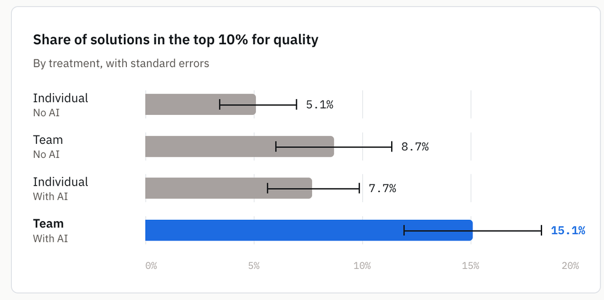

We’ve all had the frustrating experience of being in the zone and then feeling like we’ve broken our stride when we need to use an AI tool. We need to open a new window, explain to the AI why and how we’re doing this task, and eventually paste what we’ve made back into the tool where our teammates are working and explain what we’ve done. These bumpy connections between our tools, other humans, and AI interfaces force us to change our ways of working to loop in AI. What if there was a way to bring AI into the tools and collaboration spaces where we’re already working with each other?

## 01 — Solving lost context, long explanations, and task switching with agent teammates

Our AI Industrialization team brought custom agents into our Slack channels using DAM, which enabled them to become full-fledged agent teammates. An agent teammate is more than just a chatbot in Slack. It hears the discussion, knows who does what, and acts with the team's tools. We’ve found that three aspects are needed for an agent teammate to integrate itself in our team's work:

- Full read and write access to our Slack discussions
- Knowledge of human team members’ roles and responsibilities
- Access to the tools like GitHub where we track and do our work

## 02 — Humans and agent teammates collaborating in Slack

To illustrate what this looks like in practice, we’d like to introduce DAMitha, our team’s custom design agent that we interact with in Slack. This is what a typical experience with DAMitha looks like: Our designer uncovers a UI issue and posts about it in our design Slack channel. One of our developers responds with information about the technical underpinnings of that issue, and a PM chimes in with an idea for how to fix it. The designer (or anyone in the channel) types "@DAMitha write an issue for this", prompting DAMitha to read the thread, check GitHub for related issues, and file an issue translating all this rich context into concise text following our team’s format.

No context is lost between tools, no human focus is disrupted, and there’s no need to explain to the agent what’s going on before it takes work off our plates. DAMitha is one of several agent teammates our team has built to support specific tasks, and tagging them into our conversations has become a routine part of the day.

## 03 — Benefits of agent teammates

We’ve seen three key benefits from agent teammates like DAMitha:

- Everyone’s tickets are structured the same way and meet the same quality standard. DAMitha enables everyone to file a well-structured issue regardless of training or experience.
- Tickets can be filed immediately, even mid-conversation, while details are fresh and without breaking humans’ focus.
- Duplicate issue filings are reduced. Agent teammates check whether similar issues already exist before filing, a step that people usually skip.

"It's a small thing, but it's a great enabler," says Matous Havlena, Agentic AI Tech Lead for DAM. Without the agent, a busy person in Slack might file a title and nothing else. Overall, our agent teammates are filing issues as good as, if not better than, their human counterparts.

## 04 — Evidence from a field experiment

Our experience is anecdotal, but a recent HBS study gives rigor to what we’ve been witnessing firsthand. In a randomized controlled trial, 776 professionals at Procter & Gamble worked through a simulated product development task. Teams working with AI were significantly more likely to produce top-tier solutions than teams without AI or individuals using AI alone. They also finished 12–16% faster than the groups without AI.

Source: Dell’Acqua, Ayoubi, Lifshitz, Sadun, Mollick et al., *The Cybernetic Teammate* (HBS working paper, 2025). Also reported in [One Useful Thing](https://www.oneusefulthing.org/p/the-cybernetic-teammate).

## 05 — Tips to build your own agent teammates

If you’re ready to bring agent teammates into your own workspaces, we have some tips to get you started:

- Invite agents to the channels where your team works. Let them listen, so no one has to summarize the conversation for a bot.
- Assign agent teammates the work nobody volunteers for: filing issues, logging outreach, finding speakers.
- Encode individual expertise as skills, allowing the entire team to be as good as your most skilled person. Our prototyper skill lets non-designers build prototypes on our design system, and a user research skill allows anyone to write questions that aren't leading.
- Collaborate with agent teammates in open channels. Our team learned what was possible by watching how other human team members interacted with agent team members.
- Keep a human in the loop where it counts. People set goals, values, and process. Agents keep the structure running.

## 06 — Get started

- Invite one agent to a channel in Slack. `/bind [agent name]`
- Give it one chore nobody wants. `@DAM draft an issue based on the thread`
- Turn one expert's know-how into a skill. `@DAM build a prototype with 3 options to address this issue`

Then watch what your team learns from each other.

*This post draws on an interview with Jenna Winkler and Matous Havlena.*
